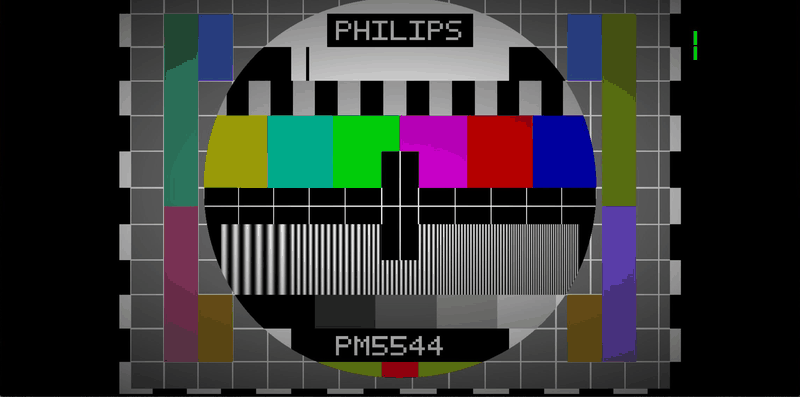
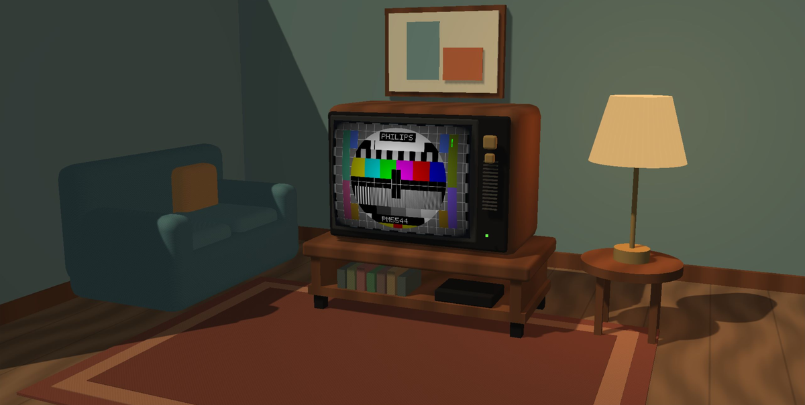
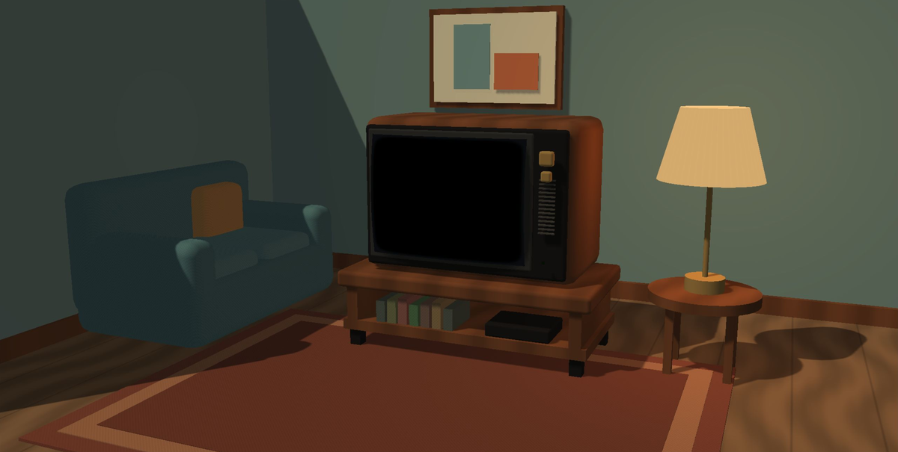
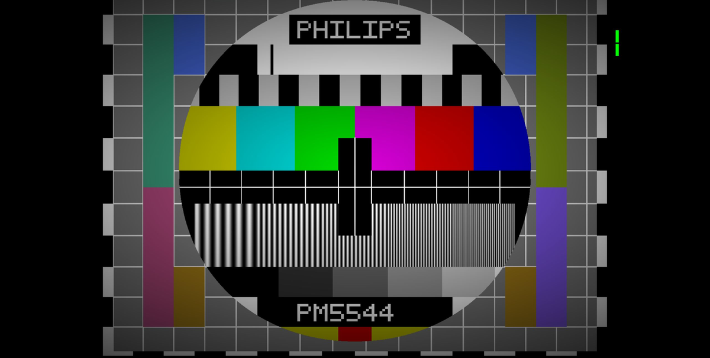
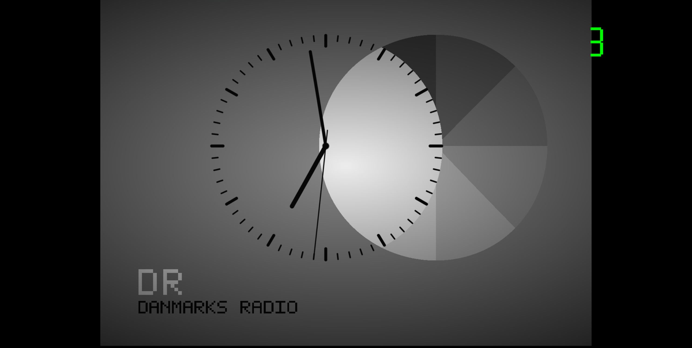
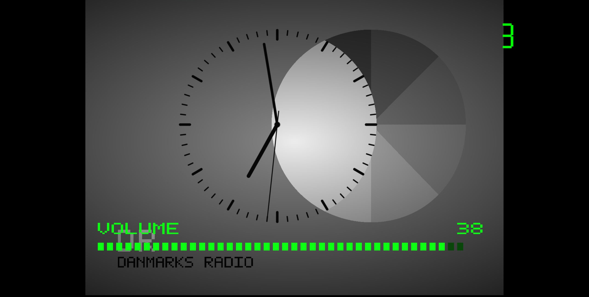
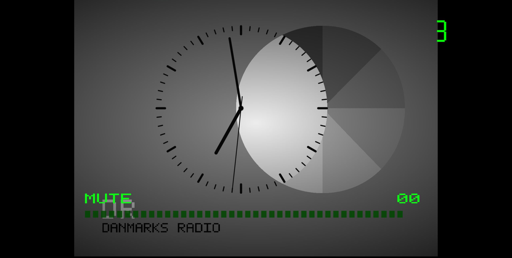

# CRT

A Windows desktop CRT television simulator built with C++20, Win32, Direct3D 11, and HLSL. Eleven channels combine animated static, historical broadcast charts, live clocks, and procedural audio. Channel 11 is a furnished 3D living room with its own independently controlled CRT; the simulator also features volume and mute controls and a custom television icon.



| Room TV on | Room TV off (P) |
| --- | --- |
|  |  |

Sampled captures from the running application; the GIF is silent and pauses between demonstrations are shortened.

| Philips PM5544 | Live Danish clock |
| --- | --- |
|  |  |
| **Volume display** | **Mute display** |
|  |  |

Previews are refreshed before every merge. See [the capture workflow](docs/media/README.md).

## Build

Open `CRT.slnx` in Visual Studio with the Desktop development with C++ workload, MSVC v145, and a Windows 10/11 SDK installed. Build Debug or Release for x64 or Win32. The broadcast Shader Model 5.0 shaders are compiled and embedded as resources during the build. The room shaders are embedded as source and compiled once on first entering channel 11.

From a Visual Studio developer terminal:

```powershell
msbuild CRT/CRT.vcxproj /t:Build /p:Configuration=Debug /p:Platform=x64
```

The project selects the 64-bit compiler tools. Direct3D feature level 11.0 hardware is required to run the app.

## Controls

- Left / Right: switch between eleven channels. From channel 1, Left enters the room directly.
- A / D: switch the television inside channel 11 between broadcasts 1–10. Its selection is remembered when leaving and returning to the room, for the current session.
- P: turn the TV inside channel 11 off/on. Its screen, sound, indicator and glow fade out while the room stays lit. The TV's power state is remembered for the current session.
- Up / Down: adjust volume (0–40); a green horizontal segmented scale appears for three seconds.
- Space: power off the whole view; press again after the fade completes to power on. This does not reset the inner TV's power state.
- Escape: exit.
- M: set volume to zero and show MUTE; press again to restore the previous level. Up raises volume from zero.

Audio is generated with XAudio2: channels 2, 5 and 8 have static, channel 4 plays a steady 1 kHz test tone, and channel/power changes play short effects. Both static and the test tone fade with screen power and obey the M mute control. If no audio device is available, the simulator continues silently and reports this in the title.

The window supports resizing and minimize/restore.

## Living room (channel 11)

A fixed perspective camera looks into a stylized room with a wooden CRT cabinet and stand, sofa, rug, lamp and framed print. Procedural meshes, depth testing, a cached shadow map and warm lighting give the scene depth without downloaded models or textures. The camera adjusts its field of view for narrow windows.

The original broadcast renderer draws into a 1024×768 GPU texture mapped onto a curved 4:3 screen. All ten broadcasts retain their animation, clocks, channel indicators and volume overlays. Audio follows the inner TV's selected broadcast and power state while the room is active. P independently switches that TV off/on; the furniture and lamp remain visible. A/D can select its next broadcast while it is off. Volume and mute remain shared application controls, and Space fades the whole view off. The room does not recursively show itself.

## Test charts

The ten channels mix animated static, color bars and historical test charts. Channels 2, 5 and 8 show static at different brightness levels; channel 4 has simple color bars, and channel 10 has multilevel broadcast color bars. The other channels feature four historical charts and a ghosted broadcast image. Charts are generated entirely in the pixel shader, including labels and clock hands; no image textures are loaded.

| Channel | Picture |
| --- | --- |
| 1 | Philips PM5544: square geometry grid, circle, PAL colour-difference patches, six colour bars, centre graticule, five frequency bands and six grayscale steps |
| 2 | Bright animated monochrome static |
| 3 | Danmarks Radio clock ident: overlapping clock and grayscale discs, minute ticks and live hour, minute and second hands |
| 4 | Simple full-screen color bars |
| 5 | Medium-bright animated monochrome static |
| 6 | UEIT (УЭИТ): large circle, four resolution discs, two colour-bar rows, grayscale, alternating chroma patches, diagonal transition marks and frequency ruler |
| 7 | Colour bars with ghosting: a faint delayed image shifted to the right, including the station logo and local-time clock |
| 8 | Dim animated monochrome static |
| 9 | TIT-0249 (ТИТ-0249): monochrome circle and grid, corner wedges, resolution markings, grayscale and concentric alignment targets |
| 10 | Multilevel broadcast color bars |
| 11 | Furnished 3D room with an independently controlled CRT playing broadcasts 1–10 |

The charts fit a 4:3 area when the window is resized and pass through the existing CRT curvature, glow and vignette. The DR clock uses the computer's local wall-clock time, sampled every frame, with a ticking second hand and a mechanical click on each second instead of a test tone. Channel 1 plays an original procedural lounge miniature: piano, plucked bass and brush percussion, 96 BPM, eight bars in a 20-second loop with wrapped note tails. Music and clock clicks obey mute and screen power. Channels 4, 6, 9 and 10 play the 1 kHz test tone.

These are procedural visual recreations, not calibrated PAL/SECAM signal generators. Fonts, fine resolution marks and DR lettering are recreated geometrically; they are not pixel-for-pixel copies of the archival scans.

### Visual references

- [Philips PM5544](https://commons.wikimedia.org/wiki/File:Philips_PM5544.svg): visual reference by ebnz and subsequent contributors, CC BY 2.5. The chart is redrawn procedurally.
- [UEIT](https://commons.wikimedia.org/wiki/File:Ueitm768.png): generated reference by Andrey Korobeynikov.
- [TIT-0249](https://housekeeping.academic.ru/pictures/housekeeping/ris_620.jpg): archival layout and markings.
- [Danmarks Radio clock](https://danskradio.dk/images/drtvur.jpg): archival DR clock ident. The old Danish image host linked in the [LiveJournal collection](https://trepang.livejournal.com/372695.html) is unavailable; this accessible DR variant is used instead.

## Validation

Debug and Release builds for x64 and Win32 passed for the room implementation. The Release x64 application was run interactively to check all ten inner broadcasts, A/D wraparound, leaving and returning to the remembered inner channel, animated static, moving clock hands, volume adjustment, mute restoration, power off/on, narrow-window resizing and maximization. Fresh captures from that executable replace the README previews; the GIF is silent. Audio routing was checked in code, but this capture session did not include an independent listening test.

Independent TV power was checked with both static and the clock: P leaves the room lit, A/D can change the selected broadcast while the TV is off, and the off state survives leaving/re-entering the room and a Space power cycle. P has no effect on the original full-window channels. The final build and refreshed previews include this behavior.

Channel 7 has its own mildly distorted 1 kHz carrier with frequency and amplitude modulation, soft saturation, quiet hiss and 50 Hz hum. Its eight-second loop uses periodic modulation and fades the hiss at the seam. M and the power fade apply to this voice too.

### Historical audio notes

Audio accompaniment depended on the broadcaster and test procedure, not just the chart design.

- UEIT: GOST 9021-88, Appendix 4, specifies UEIT video with a 1000 Hz sinusoidal audio signal for the described receiver adjustment procedure. [Standard scan](https://meganorm.ru/Data2/1/4294821/4294821137.pdf).
- TIT-0249 and colour bars: PTE-95, Appendix 9, specifies 1000 Hz during a satellite-channel technical test using colour bars, EIT or TIT-0249. Another stage terminates the audio input in 600 ohms. These are technical-test procedures, not evidence that every broadcast of the chart used a tone. [PTE-95](https://rags.ru/documents/prod/akt_forma/3/pravi_72544.html).
- Philips PM5544: the Broadcast Engineering Museum's engineer describes the generator as having no audio capability; accompaniment is external. [Museum engineer's explanation](https://golbornevintageradio.co.uk/forum/showthread.php?mode=linear&pid=102243&tid=9304). RTÉ transmissions included PM5544 with tone and, on RTÉ One, music tapes. [RTÉ history](https://rewind.thetvroom.com/38801/features/early-in-vision-teletext-in-ireland/). No specific frequency is established by that account.
- DR clock: the procedural mechanical tick is an artistic choice. The audio accompanying this exact historical clock design has not been verified. Do not describe the generated tick as an archival reconstruction.
